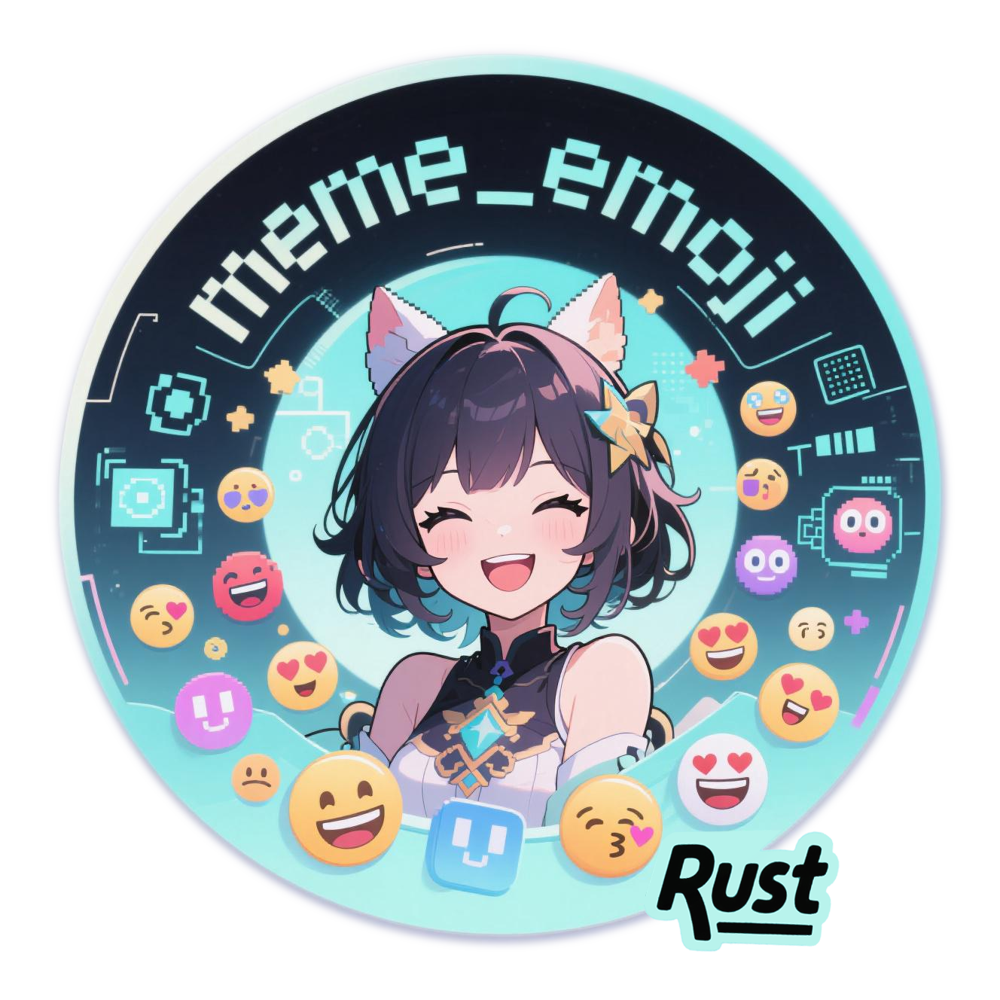
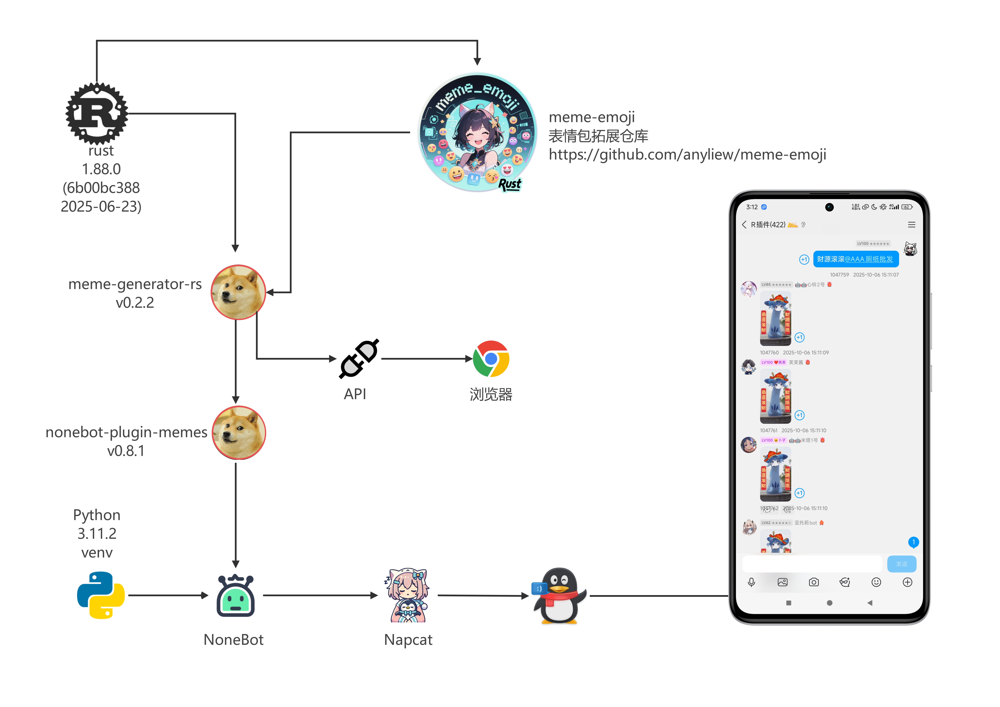
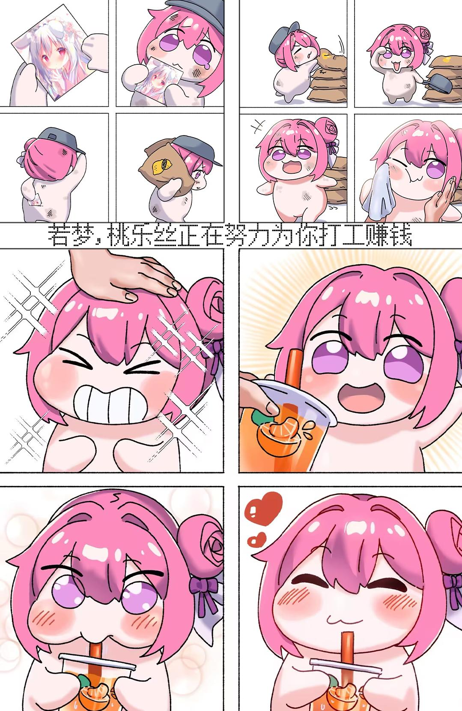
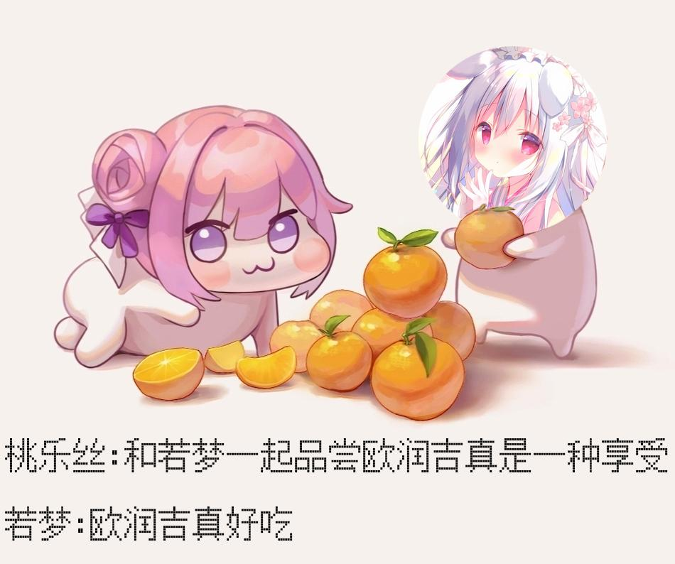

# meme-emoji

  
  
  <a href="https://pypi.org/project/meme-generator-rs">
  <a href="https://crates.io/crates/meme_generator">
    
    
  <a href="https://qm.qq.com/q/KZFZGdWmyG">
    

## meme-emoji 表情包扩展仓库 

*🚀* 基于 [meme-generator-rs](https://github.com/MemeCrafters/meme-generator-rs) 做的表情包扩展仓库~

*✨* 为你的聊天机器人添加更多趣味表情生成！

## ✨特性

- ✅ **海量表情** 偶尔做做热门表情包，也欢迎投稿高清有趣的素材
- ⚡ **实时生成** 支持通过指令快速生成表情
- 🔄 **搭配使用** 需要搭配 [meme-generator-rs](https://github.com/MemeCrafters/meme-generator-rs) 一起使用

- ✨**搭配演示架构图所示(仅供参考)：**

## 🤠 表情示例

### 🖼 参考预览图：

🖼点击展开 预览图 "为你打工"

🖼点击展开 预览图 "欧润吉"

### 😀 表情列表清单

#### 😉 名称排序  A-Z

* [表情列表](https://github.com/anyliew/meme-emoji/wiki/%E8%A1%A8%E6%83%85%E5%88%97%E8%A1%A8)

## 📄 使用教程 

可在 [releases](https://github.com/anyliew/meme-emoji/releases) 或者 [Actions](https://github.com/anyliew/meme-emoji/actions/workflows/build.yml) 中下载编译好的动态链接库

并参考 [`meme-generator-rs` 加载其他表情的方式](https://github.com/MemeCrafters/meme-generator-rs/wiki/%E5%8A%A0%E8%BD%BD%E5%85%B6%E4%BB%96%E8%A1%A8%E6%83%85) 进行加载

- [meme-generator-rs wiki](https://github.com/MemeCrafters/meme-generator-rs/wiki) 
- [meme-emoji wiki](https://github.com/anyliew/meme-emoji/wiki) 

## ⚖ 许可证

> MIT License https://github.com/anyliew/meme-emoji/blob/main/LICENSE

## 📝 反馈

### 🤔 issues

> issues https://github.com/anyliew/meme-emoji/issues 

单个表情有问题反馈请附带日志和截图
答复受限网络没那么快及时处理

### 🐧QQ Group

* [进群注意事项](https://github.com/anyliew/meme_emoji/wiki/qq_group)

## 🥳 投稿

> 🚧欢迎投稿高清素材，看到一些有趣的素材图片会制作成表情更新到本仓库！
>
> 通过issues中的模板 “投稿素材” 进行投稿，如果能Pr则更加完美，实在是泰裤辣~

## 🔗 相关链接

### meme-generator-rs 
- [meme-generator-rs](https://github.com/MemeCrafters/meme-generator-rs) 

### wiki 文档
- [meme-generator-rs wiki](https://github.com/MemeCrafters/meme-generator-rs/wiki)
- [meme-emoji wiki](https://github.com/anyliew/meme-emoji/wiki)

## ⭐ 支持本项目

如果你觉得本项目对你有帮助，请给本项目点一个star⭐

## 💬 免责声明

- 本项目仅供学习和交流使用，禁止用于任何商业用途及违法用途。

- 项目中的图片等资源均来自互联网，如有侵权请及时联系开发者，我们会尽快处理删除相关内容。
