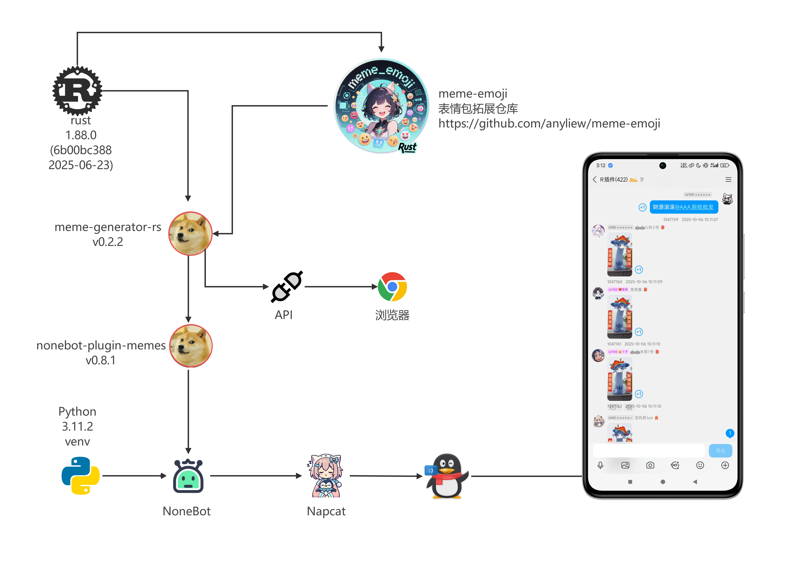
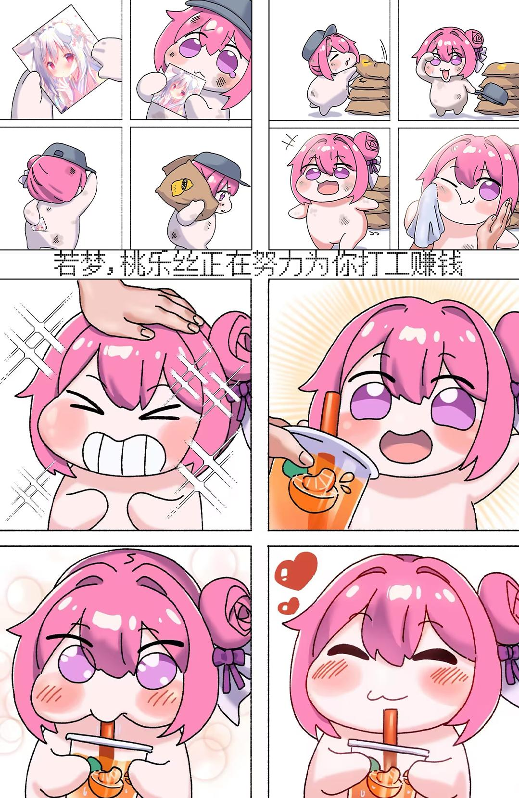

**基于 [meme-generator-rs](https://github.com/MemeCrafters/meme-generator-rs) 的表情包扩展仓库（Rust 版）**

为你的聊天机器人添加更多趣味表情生成

[表情列表](https://github.com/anyliew/meme-emoji/wiki/%E8%A1%A8%E6%83%85%E5%88%97%E8%A1%A8) ·
[使用文档](https://github.com/anyliew/meme-emoji/wiki) ·
[问题反馈](https://github.com/anyliew/meme-emoji/issues) ·
[素材投稿](https://github.com/anyliew/meme-emoji/issues/new?template=feature.yml)

---

## 特性

- ✅ **海量表情** 偶尔做做热门表情包，也欢迎投稿高清有趣的素材
- ⚡ **实时生成** 编译为动态库后由主程序加载，调用无额外进程开销
- 🔄 **搭配使用** 需要搭配 [meme-generator-rs](https://github.com/MemeCrafters/meme-generator-rs) 一起使用

## 示例

🖼 点击展开效果预览（“为你打工”）

 

🖼 点击展开效果预览（“欧润吉”）

 

### 表情列表

- 😉 名称排序 A-Z：[表情列表](https://github.com/anyliew/meme-emoji/wiki/%E8%A1%A8%E6%83%85%E5%88%97%E8%A1%A8)

## 文档

完整文档托管在 Wiki：

- 首页：[meme-emoji Wiki](https://github.com/anyliew/meme-emoji/wiki)
- 安装部署：[Linux](https://github.com/anyliew/meme-emoji/wiki/Install-Linux) · [Windows](https://github.com/anyliew/meme-emoji/wiki/Install-Windows) · [Docker](https://github.com/anyliew/meme-emoji/wiki/Install-Docker)
- 配置与使用：[配置文件](https://github.com/anyliew/meme-emoji/wiki/Configuration) · [命令行](https://github.com/anyliew/meme-emoji/wiki/Usage-CLI) · [API 与程序调用](https://github.com/anyliew/meme-emoji/wiki/Usage-API) · [Web 前端](https://github.com/anyliew/meme-emoji/wiki/Usage-Web)
- 加载方式：[加载外部表情](https://github.com/anyliew/meme-emoji/wiki/Loading-External)
- 兼容与排错：[版本兼容](https://github.com/anyliew/meme-emoji/wiki/Compatibility) · [常见问题](https://github.com/anyliew/meme-emoji/wiki/FAQ)

## 链接

| 分类 | 项目 | 地址 |
| --- | --- | --- |
| 上游 | meme-generator-rs | <https://github.com/MemeCrafters/meme-generator-rs> |
| 上游 | meme-generator-rs Wiki | <https://github.com/MemeCrafters/meme-generator-rs/wiki> |
| 文档 | meme-emoji Wiki | <https://github.com/anyliew/meme-emoji/wiki> |
| Python | meme_emoji | <https://github.com/anyliew/meme_emoji> |
| Python | crazy_emoji | <https://github.com/anyliew/crazy_emoji> |
| Python | furina_emoji | <https://gitcode.com/anyliew/furina_emoji> |
| Rust | meme-emoji | <https://github.com/anyliew/meme-emoji> |
| Rust | crazy-emoji | <https://github.com/anyliew/crazy-emoji> |
| Rust | jj-emoji | <https://github.com/anyliew/jj-emoji> |

## 投稿与反馈

### 投稿素材

> 🚧 欢迎投稿高清素材，看到有趣的素材会制作成表情更新到本仓库！
>
> 通过 Issues 中的「投稿素材」模板提交；若能直接提 PR 则更好 🎉

投稿前建议先阅读 [新表情编写指北](https://github.com/MemeCrafters/meme-generator-rs/wiki/%E6%96%B0%E8%A1%A8%E6%83%85%E7%BC%96%E5%86%99%E6%8C%87%E5%8C%97)，
并确认表情目录结构与命名符合本仓库约定。

### 问题反馈

> 提交地址：<https://github.com/anyliew/meme-emoji/issues>

- 单个表情异常请附带**完整报错日志**与**复现截图**
- 请说明运行环境（系统与架构、主程序版本、本库编译所用的 Rust 版本）
- 受网络条件限制，答复可能不够及时，请耐心等待

## 支持

如果本项目对你有帮助，请给本项目点一个 star，你的鼓励是我们不断前进的动力。

## 致谢

感谢以下开源项目及作者的贡献：

- **[meme-generator-rs](https://github.com/MemeCrafters/meme-generator-rs)** —— Rust 版表情包生成器内核
- **[meme-generator](https://github.com/MemeCrafters/meme-generator)** —— Python 版内核，表情素材的原始来源
- **[meme_emoji](https://github.com/anyliew/meme_emoji)** —— Python 版表情仓库，本仓库按模块逐个移植

## 贡献者

感谢这些了不起的人（[emoji-key](https://allcontributors.org/emoji-key/#natural-language-processing)）：

<!-- ALL-CONTRIBUTORS-LIST:START - Do not remove or modify this section -->
<!-- prettier-ignore-start -->
<!-- markdownlint-disable -->
<table>
  <tbody>
    <tr>
      <td align="center" valign="top" width="50%"><a href="https://github.com/balh55y"> <b>balh55y</b></a> <a href="https://github.com/anyliew/meme-emoji/commits?author=balh55y" title="Code">💻</a></td>
      <td align="center" valign="top" width="50%"><a href="https://github.com/mmmpipi"> <b>mmmpipi</b></a> <a href="https://github.com/anyliew/meme-emoji/commits?author=mmmpipi" title="Code">💻</a></td>
    </tr>
  </tbody>
</table>
<!-- markdownlint-restore -->
<!-- prettier-ignore-end -->
<!-- ALL-CONTRIBUTORS-LIST:END -->

本项目遵循 [all-contributors](https://github.com/all-contributors/all-contributors) 规范。

## 许可

本项目沿用上游 [meme-generator-rs](https://github.com/MemeCrafters/meme-generator-rs) 的 **MIT License**。

- 本仓库许可证全文：[LICENSE](./LICENSE)
- 上游许可证全文：[MemeCrafters/meme-generator-rs/LICENSE](https://github.com/MemeCrafters/meme-generator-rs/blob/main/LICENSE)

## 免责声明

- 本项目仅供学习和交流使用，禁止用于任何商业用途及违法用途
- 项目中的图片等资源均来自互联网，如有侵权请及时联系开发者，我们会尽快处理删除相关内容
